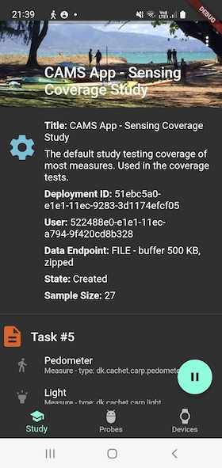
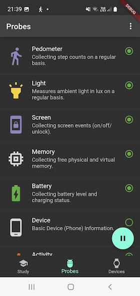
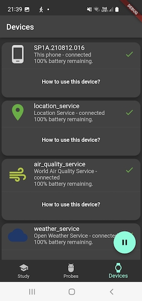
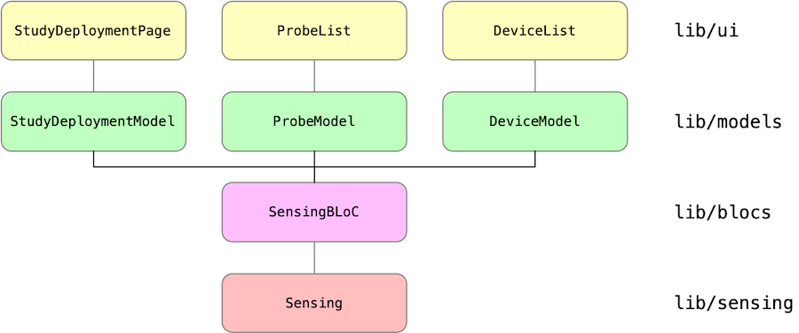

# CARP Mobile Sensing App

The CARP Mobile Sensing App provides an example on how to use the [`carp_mobile_sensing`](https://pub.dartlang.org/packages/carp_mobile_sensing) package.
The app sets up a `SmartphoneStudyProtocol` (or just "Protocol") that uses a set of `Device`s and collects a set of `Measures`s.
Following the [CARP Mobile Sensing architecture](https://github.com/cph-cachet/carp.sensing-flutter/wiki/1.-Software-Architecture), the protocol is "Deployed" on the phone and data collection is done via a set of "Probes" which each use a "Device", including the phone itself.
The UI of the app is shown below, showing (from left to right) the Study Deployment page, the Probe List page, and the Device List page.

 __
__


The architecture of the app is illustrated below. It follows the [BLoC architecture](https://medium.com/flutterpub/architecting-your-flutter-project-bd04e144a8f1),
which is recommended by the [Flutter Team](https://www.youtube.com/watch?v=PLHln7wHgPE).



All sensing logic is handled via the `Sensing` class responsible for handling sensing via the [`carp_mobile_sensing`](https://pub.dartlang.org/packages/carp_mobile_sensing) package.
All business logic is handled by the singleton `SensingBLoC` which is the only way the UI models can access and modify data or initiate life cycle events (like pausing and resuming sensing).
All data to be shown in the UI are handled by (UI) models, and finally each screen is implemented as a [`StatefulWidget`](https://docs.flutter.io/flutter/widgets/StatefulWidget-class.html) in Flutter.
Each UI widget only knows its corresponding model and the model knows the BloC.
**NO** data or control flows between the UI and the Bloc or Sensing layer.

## Sensing BLoC

Since the [`SensingBLoC`](https://github.com/cph-cachet/carp.sensing-flutter/blob/master/apps/carp_mobile_sensing_app/lib/src/blocs/sensing_bloc.dart) is the controller of the entire app, let's look closer on this class. Below are essential parts shown (omitting some implementation details):

````dart
class SensingBLoC {
  /// What kind of deployment are we running? Default is local.
  DeploymentMode deploymentMode => ...

  /// The URI of the CAWS server to use depending on the current [deploymentMode].
  String get uri => ...

  /// The study id for the currently running deployment.
  /// Returns the study id cached locally on the phone (if available).
  /// Returns `null` if no study is deployed (yet).
  String? get studyId => ...

  /// The study deployment id for the currently running deployment.
  /// Returns the deployment id cached locally on the phone (if available).
  /// Returns `null` if no study is deployed (yet).
  String? get studyDeploymentId => ...
  
  /// The device role name for the currently running deployment.
  /// Returns the role name cached locally on the phone (if available).
  /// Returns `null` if no study is deployed (yet).
  String? get deviceRolename => ...
  
  /// Use the cached study deployment?
  bool get useCachedStudyDeployment => _useCached;

  /// Should sensing be automatically resumed on app startup?
  bool get resumeSensingOnStartup => _resumeSensingOnStartup;

  /// The [SmartphoneDeployment] deployed on this phone.
  SmartphoneDeployment? get deployment => bloc.sensing.controller?.deployment;

  /// What kind of deployment are we running. Default is local.
  DeploymentMode deploymentMode = DeploymentMode.local;

  /// The preferred format of the data to be uploaded according to
  /// [NameSpace]. Default using the [NameSpace.CARP].
  String dataFormat = NameSpace.CARP;

  StudyDeploymentModel? _model;

  /// Get the study deployment model for this app.
  StudyDeploymentModel get studyDeploymentModel =>
      _model ??= StudyDeploymentModel(deployment!);

  /// Get a list of running probes
  Iterable<ProbeModel> get runningProbes =>
      bloc.sensing.runningProbes.map((probe) => ProbeModel(probe));

  /// Get a list of running devices
  Iterable<DeviceModel> get availableDevices =>
      bloc.sensing.availableDevices.map((device) => DeviceModel(device));

  /// Initialize the BLoC.
  Future<void> initialize({
    DeploymentMode deploymentMode = DeploymentMode.local,
    String? deploymentId,
    String dataFormat = NameSpace.CARP,
    bool useCachedStudyDeployment = true,
    bool resumeSensingOnStartup = false,
  }) async {
    await Settings().init();
    Settings().debugLevel = DebugLevel.debug;
    this.deploymentMode = deploymentMode;
    if (deploymentId != null) studyDeploymentId = deploymentId;
    this.dataFormat = dataFormat;
    _resumeSensingOnStartup = resumeSensingOnStartup;
    _useCached = useCachedStudyDeployment;

    info('$runtimeType initialized');
  }

  /// Connect to a [device] which is part of the [deployment].
  void connectToDevice(DeviceModel device) => SmartPhoneClientManager()
      .deviceController
      .devices[device.type!]!
      .connect();

  void start() async => SmartPhoneClientManager().start();
  void stop() async => SmartPhoneClientManager().stop();

  /// Is sensing running, i.e. has the study executor been started?
  bool get isRunning =>
      SmartPhoneClientManager().state == ClientManagerState.started;
}

final bloc = SensingBLoC();
````

The BLoC basically plays three roles:

* it holds core business data like `studyId`, `deploymentId`, `deviceRolename`, and the `deployment` configuration
* it can create (UI) models such as the `StudyDeploymentModel` and the list of `ProbeModel`s and `DeviceModel`s
* it provide a set of life cycle methods for sensing like `initialize`, `connectToDevice` and `start`.

Finally, note that the singleton `bloc` variable is instantiated, which makes the BLoC accessible in the entire app.

## Sensing

Configuration of sensing is done in the [`Sensing`](https://github.com/cph-cachet/carp.sensing-flutter/blob/master/apps/carp_mobile_sensing_app/lib/src/sensing/sensing.dart) class.

This class also illustrates how the app can be run both in a "local" deployment mode and in different "CAWS" modes.
Depending on the "deployment mode" (local or using CAWS), deployment is initialized using the [`SmartphoneDeploymentService`](https://pub.dev/documentation/carp_mobile_sensing/latest/runtime/SmartphoneDeploymentService-class.html) or the [`CarpDeploymentService`](https://pub.dev/documentation/carp_webservices/latest/carp_services/CarpDeploymentService-class.html), respectively.

In the case a local deployment is used, a protocol is fetched from the `LocalStudyProtocolManager`, which is then added to the local `SmartphoneDeploymentService`.
In the case a CAWS deployment is used, the study deployment configuration will be fetched from the `CarpDeploymentService` based on the `studyDeploymentId` fetched from an invitation (this invitation is fetched as part of the `init` method of the main `App` class).

Once, the right deployment service is configured, the `SmartPhoneClientManager` singleton is configured and the study is added (based on the deployment id and the role name of the phone) and deployed.
When deployed, the runtime (`SmartphoneDeploymentController`) is configured and sampling can now be started or stopped. This part of `Sensing` is shown below:

```dart
    // Configure the client manager with the deployment service selected above
    // (local or CAWS), add the study, and deploy it.
    await SmartPhoneClientManager().configure(
      deploymentService: deploymentService,
    );
    study = await SmartPhoneClientManager().addStudy(
      bloc.studyDeploymentId!,
      bloc.deviceRolename!,
    );
    await controller?.tryDeployment();
    await controller?.configure();
```

## UI Models

The CARP Mobile Sensing App uses one UI model for each UI widget.
For example, the UI Model `StudyDeploymentModel` serves the UI Widget `StudyDeploymentPage`.
The main responsibility of the UI Model is to provide access to data (both getter and setters), which again is available via the BLoC.

The `StudyDeploymentModel` class looks like this:

`````dart
class StudyDeploymentModel {
  SmartphoneDeployment deployment;

  String get title => deployment.studyDescription?.title ?? '';
  String get description =>
      deployment.studyDescription?.description ?? 'No description available.';
  Image get image => Image.asset('assets/study.png');
  String get studyDeploymentId => deployment.studyDeploymentId;
  String get userID => deployment.userId ?? '';
  String get dataEndpoint => deployment.dataEndPoint.toString();

  /// Events on the state of the study executor
  Stream<ExecutorState> get studyExecutorStateEvents =>
      bloc.sensing.controller!.executor.stateEvents;

  /// Current state of the study executor (e.g., resumed, paused, ...)
  ExecutorState get studyState => bloc.sensing.controller!.executor.state;

  /// Get all sensing events (i.e. all [Measurement] objects being collected).
  Stream<Measurement> get measurements =>
      bloc.sensing.controller?.measurements ?? Stream.empty();

  /// The total sampling size so far since this study was started.
  int get samplingSize => bloc.sensing.controller?.samplingSize ?? 0;

  StudyDeploymentModel(this.deployment) : super();
}
`````

In this model there are only data **getters**, since in the current version of the app, you cannot change a study once it is running. However, if modification of a study was to be supported, then **setter** methods would be implemented in the model as well.
For example, the following method would enable modifying the study title.

````dart
void set title(String title) {
  ...
}
````

## UI Widgets

The top layer contains the UI widgets.
Each UI widget takes in its constructor its corresponding UI model.
For example, the `StudyVisualization` widget's `State` takes a `StudyModel` in its constructor:

`````dart
class StudyDeploymentPage extends StatefulWidget {
  const StudyDeploymentPage({super.key});
  static const String routeName = '/study';

  @override
  StudyDeploymentPageState createState() =>
      StudyDeploymentPageState(bloc.studyDeploymentModel);
}

class StudyDeploymentPageState extends State<StudyDeploymentPage> {
  final StudyDeploymentModel studyDeploymentModel;

  _StudyDeploymentPageState(this.studyDeploymentModel) : super();

  @override
  Widget build(BuildContext context) {
    ... 
  }
}
`````

In this way, the `studyDeploymentModel` is available in the entire UI Widget.
This allows us to access data and show it in the UI. For example, to show the study title and image this code is used:

````dart
 FlexibleSpaceBar(
    title: Text(studyDeploymentModel.title),
    background: Stack(
      fit: StackFit.expand,
      children: <Widget>[
        studyDeploymentModel.image,
      ],
    ),
 ),

````

More sophisticated (reactive) UI implementation can also be done. For example, to show the counter showing sampling size the following `StreamBuilder` is used.

`````dart
 StreamBuilder<Datum>(
    stream: studyDeploymentModel.samplingEvents,
    builder: (context, AsyncSnapshot<Datum> snapshot) =>
      Text('Sample Size: ${studyDeploymentModel.samplingSize}')
    )
`````
