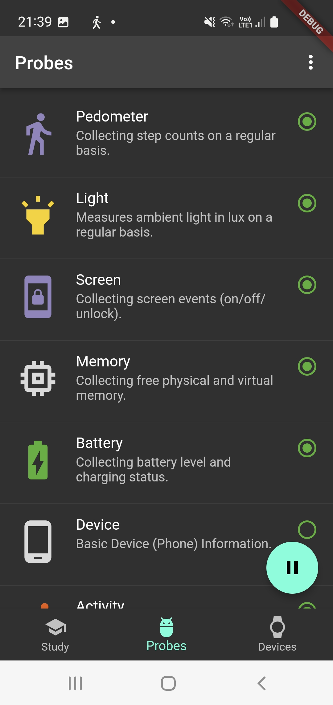
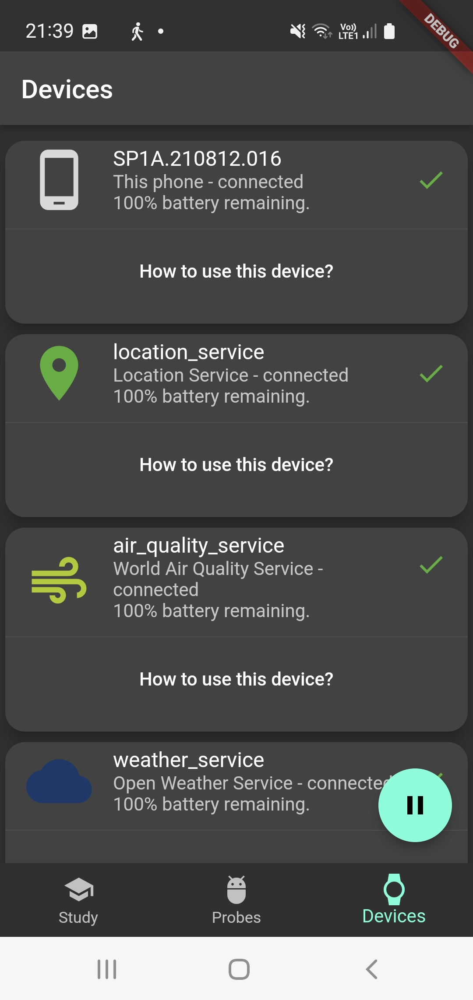

# CARP Mobile Sensing App

The CARP Mobile Sensing App provides an example on how to use the [`carp_mobile_sensing`](https://pub.dartlang.org/packages/carp_mobile_sensing) package.
The app sets up a `Study` that uses a set of `Device`s and starts a set of `Probe`s. The UI of the app is shown below, showing
(from left to right) the Study Visualization page, the Probe List page, and the Device List page.

 
 
 


The architecture of the app is illustrated below. It follows the [BLoC architecture](https://medium.com/flutterpub/architecting-your-flutter-project-bd04e144a8f1),
which is recommended by the [Flutter Team](https://www.youtube.com/watch?v=PLHln7wHgPE).


The basic architecture holds a singleton `Sensing` class responsible for handling sensing via the [`carp_mobile_sensing`](https://pub.dartlang.org/packages/carp_mobile_sensing) package. 
All business logic is handled by a singleton `BloC` which is the only way the UI models can access and modify data or initiate life cycle events (like pausing and resuming sensing).
All data to be shown in the UI are handled by (UI) models, and finally each screen is implemented as a [`StatefulWidget`](https://docs.flutter.io/flutter/widgets/StatefulWidget-class.html) in Flutter. 
Each UI widget only knows its corresponding model and the model knows the BloC. 
**NO** data or control flows between the UI and the Bloc or Sensing layer.

## Sensing BLoC

Since the BLoC is the controller of the entire app, let's start with this class.

````dart
class SensingBLoC {

  /// The study deployment id for the currently running deployment.
  String? studyDeploymentId;

  /// The [SmartphoneDeployment] deployed on this phone.
  SmartphoneDeployment? get deployment => Sensing().controller?.deployment;

  /// What kind of deployment are we running - local or CARP?
  DeploymentMode deploymentMode = DeploymentMode.LOCAL;

  /// The preferred format of the data to be uploaded according to
  /// [NameSpace]. Default using the [NameSpace.CARP].
  String dataFormat = NameSpace.CARP;

  StudyDeploymentModel? _model;

  /// Get the study deployment model for this app.
  StudyDeploymentModel get studyDeploymentModel =>
      _model ??= StudyDeploymentModel(deployment!);

  /// Get a list of running probes
  Iterable<ProbeModel> get runningProbes =>
      Sensing().runningProbes.map((probe) => ProbeModel(probe));

  /// Get a list of running devices
  Iterable<DeviceModel> get runningDevices =>
      Sensing().runningDevices!.map((device) => DeviceModel(device));

  /// Initialize the BLoC.
  Future initialize({
    DeploymentMode deploymentMode = DeploymentMode.LOCAL,
    String dataFormat = NameSpace.CARP,
  }) async {
    await Settings().init();
    Settings().debugLevel = DebugLevel.DEBUG;
    this.deploymentMode = deploymentMode;
    this.dataFormat = dataFormat;

    info('$runtimeType initialized');
  }

  /// Connect to a [device] which is part of the [deployment].
  void connectToDevice(DeviceModel device) =>
      Sensing().client?.deviceController.devices[device.type!]!.connect();

  void resume() async => Sensing().controller?.executor?.resume();
  void pause() => Sensing().controller?.executor?.pause();
  void stop() async => Sensing().controller?.stop();

  /// Is sensing running, i.e. has the study executor been resumed?
  bool get isRunning =>
      (Sensing().controller != null) &&
      Sensing().controller!.executor!.state == ExecutorState.resumed;
}

final bloc = SensingBLoC();
````

The BLoC basically plays three roles:

 * it holds business data like the `deployment` and the `deploymentId`
 * it can create (UI) models such as the `StudyDeploymentModel` and a list of `ProbeModel`, and
 * it provide a set of life cycle methods for sensing like `connectToDevice` and `resume`.

Finally, note that the singleton `bloc` variable is instantiated, which makes the BLoC accessible in the entire app.

Set up and configuration of sensing is done in the [`Sensing`](https://github.com/cph-cachet/carp.sensing-flutter/blob/master/apps/carp_mobile_sensing_app/lib/src/sensing/sensing.dart) class. 
Depending on the "deploymenet mode" (local or using CARP), sensing is initialized using the [`LocalStudyProtocolManager`](https://github.com/cph-cachet/carp.sensing-flutter/blob/master/apps/carp_mobile_sensing_app/lib/src/sensing/local_study_protocol_mananger.dart) or the [`CustomProtocolDeploymentService`](https://pub.dev/documentation/carp_backend/latest/carp_backend/CustomProtocolDeploymentService-class.html), respectivly. 

 ## UI Models
 
 In this CARP Mobile Sensing App we use one UI model for each UI widget.
 For example, the UI Model `StudyDeploymentModel` serves the UI Widget `StudyDeploymentPage`.
 The main reposibility of the UI Model is to provide access to data (both getter and setters), 
 which is done via the BLoC.

The `StudyDeploymentModel` class looks like this:

`````dart
class StudyDeploymentModel {
  SmartphoneDeployment deployment;

  String get title => deployment.protocolDescription?.title ?? '';
  String get description =>
      deployment.protocolDescription?.description ??
      'No description available.';
  Image get image => Image.asset('assets/study.png');
  String get studyDeploymentId => deployment.studyDeploymentId;
  String get userID => deployment.userId ?? '';
  String get dataEndpoint => deployment.dataEndPoint.toString();

  /// Events on the state of the study executor
  Stream<ExecutorState> get studyExecutorStateEvents =>
      Sensing().controller!.executor!.stateEvents;

  /// Current state of the study executor (e.g., resumed, paused, ...)
  ExecutorState get studyState => Sensing().controller!.executor!.state;

  /// Get all sesing events (i.e. all [Datum] objects being collected).
  Stream<DataPoint> get data => Sensing().controller!.data;

  /// The total sampling size so far since this study was started.
  int get samplingSize => Sensing().controller!.samplingSize;

  StudyDeploymentModel(this.deployment) : super();
}
`````

In this model there are only data **getters**, since in the current version of the app, you
cannot change a study once it is running. However, if modification of a study was to be 
supported, then **setter** methods would be implemented in the model as well.
For example, the following method would enable modifying the study title.

````dart
void set title(String title) {
  ...
}
````

## UI Widgets

The final layer is the UI widgets. 
Each UI widget takes in its constructor its corresponding UI model. 
For example, the `StudyVisualization` widget's `State` takes a `StudyModel` in its constructor:

`````dart
class StudyDeploymentPage extends StatefulWidget {
  const StudyDeploymentPage({Key? key}) : super(key: key);

  _StudyDeploymentPageState createState() =>
      _StudyDeploymentPageState(bloc.studyDeploymentModel);
}

class _StudyDeploymentPageState extends State<StudyDeploymentPage> {
  final StudyDeploymentModel studyDeploymentModel;

  _StudyDeploymentPageState(this.studyDeploymentModel) : super();

  @override
  Widget build(BuildContext context) {
    ... 
  }
}
`````

In this way, the `studyDeploymentModel` is available in the entire UI Widget. 
This allow us to access data and show it in the UI. For example, to show the study title and image
this code is used:

````dart
 FlexibleSpaceBar(
    title: Text(studyDeploymentModel.title),
    background: Stack(
      fit: StackFit.expand,
      children: <Widget>[
        studyDeploymentModel.image,
      ],
    ),
 ),

````

More sophisticated (reactive) UI implementation can also be done. For example, to show the
counter showing sampling size the following `StreamBuilder` is used.

`````dart
 StreamBuilder<Datum>(
    stream: studyDeploymentModel.samplingEvents,
    builder: (context, AsyncSnapshot<Datum> snapshot) {
      return Text('Sample Size: ${studyDeploymentModel.samplingSize}');
    })
`````

